# AdventJS 2025

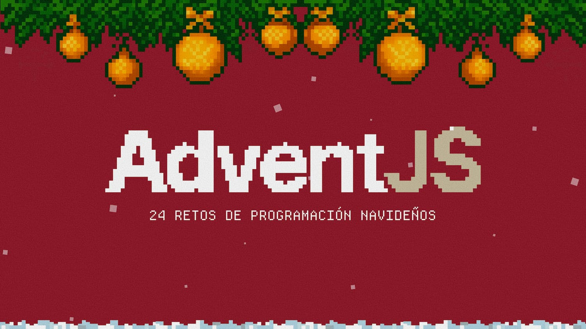

- [AdventJs](https://adventjs.dev/)
- Soluciones con Javascript

|  #  |                                           Reto                                            | Dificultad |                                                                                    Solucion                                                                                     |
| :-: | :---------------------------------------------------------------------------------------: | :--------: | :-----------------------------------------------------------------------------------------------------------------------------------------------------------------------------: |
| 01  |       [Filtrar los regalos defectuosos](https://adventjs.dev/es/challenges/2025/1)        |   FÁCIL    |    <a href='https://github.com/cundodev/AdventJS/tree/main/2025/01'>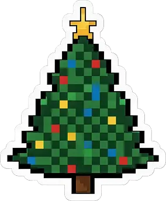</a>    |
| 02  |             [Fabrica los juguetes](https://adventjs.dev/es/challenges/2025/2)             |   FÁCIL    |      <a href='https://github.com/cundodev/AdventJS/tree/main/2025/02'>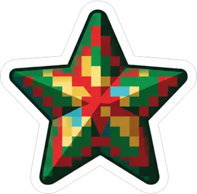</a>      |
| 03  |               [Ayuda al becario](https://adventjs.dev/es/challenges/2025/3)               |   FÁCIL    |             |
| 04  |           [Descifra el PIN de Santa](https://adventjs.dev/es/challenges/2025/4)           |   MEDIO    |  <a href='https://github.com/cundodev/AdventJS/tree/main/2025/04'>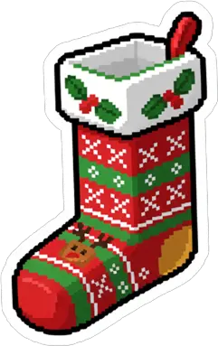</a>  |
| 05  |       [La cuenta atrás para el despegue](https://adventjs.dev/es/challenges/2025/5)       |   FÁCIL    |    <a href='https://github.com/cundodev/AdventJS/tree/main/2025/05'>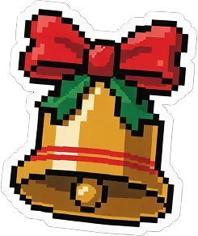</a>     |
| 06  |             [Emparejando guantes](https://adventjs.dev/es/challenges/2025/6)              |   FÁCIL    |    <a href='https://github.com/cundodev/AdventJS/tree/main/2025/06'>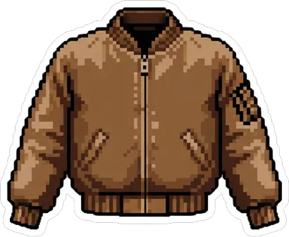</a>     |
| 07  |              [Montando el árbol](https://adventjs.dev/es/challenges/2025/7)               |   MEDIO    |          |
| 08  |          [Encuentra el juguete único](https://adventjs.dev/es/challenges/2025/8)          |   FÁCIL    |          |
| 09  |           [El reno robot aspirador](https://adventjs.dev/es/challenges/2025/9)            |  DIFÍCIL   |              |
| 10  |      [Profundidad de la magia navideña](https://adventjs.dev/es/challenges/2025/10)       |   FÁCIL    |   <a href='https://github.com/cundodev/AdventJS/tree/main/2025/10'>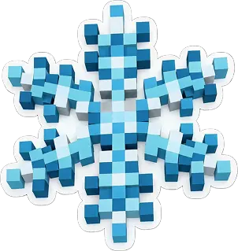</a>   |
| 11  |           [Regalos sin vigilancia](https://adventjs.dev/es/challenges/2025/11)            |   FÁCIL    |     |
| 12  |              [Batalla de elfos](https://adventjs.dev/es/challenges/2025/12)               |   MEDIO    |    <a href='https://github.com/cundodev/AdventJS/tree/main/2025/12'>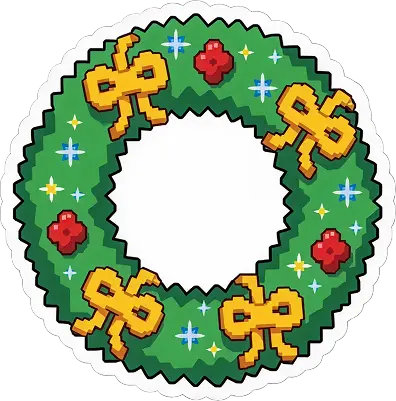</a>     |
| 13  |            [La cadena de montaje](https://adventjs.dev/es/challenges/2025/13)             |   MEDIO    |          |
| 14  |        [Encuentra el camino al regalo](https://adventjs.dev/es/challenges/2025/14)        |   FÁCIL    |        |
| 15  |              [Dibujando tablas](https://adventjs.dev/es/challenges/2025/15)               |   MEDIO    |   <a href='https://github.com/cundodev/AdventJS/tree/main/2025/15'>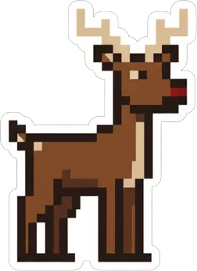</a>    |
| 16  |       [Empaquetando regalos para Santa](https://adventjs.dev/es/challenges/2025/16)       |   FÁCIL    |  |
| 17  |         [El panel de luces navideñas](https://adventjs.dev/es/challenges/2025/17)         |   FÁCIL    |   <a href='https://github.com/cundodev/AdventJS/tree/main/2025/17'>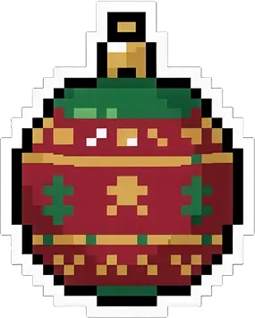</a>    |
| 18  |        [Luces en línea con diagonales](https://adventjs.dev/es/challenges/2025/18)        |   MEDIO    |     <a href='https://github.com/cundodev/AdventJS/tree/main/2025/18'>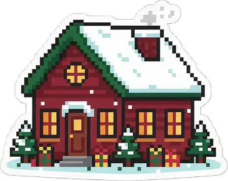</a>     |
| 19  |        [El viaje secreto de Papá Noel](https://adventjs.dev/es/challenges/2025/19)        |   FÁCIL    |         <a href='https://github.com/cundodev/AdventJS/tree/main/2025/19'>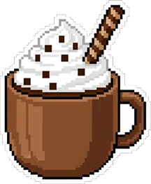</a>         |
| 20  |             [El almacén vertical](https://adventjs.dev/es/challenges/2025/20)             |   FÁCIL    |   <a href='https://github.com/cundodev/AdventJS/tree/main/2025/20'>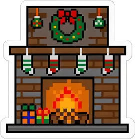</a>   |
| 21  |            [El robot de limpieza](https://adventjs.dev/es/challenges/2025/21)             |   MEDIO    |      |
| 22  |           [El laberinto del trineo](https://adventjs.dev/es/challenges/2025/22)           |  DIFÍCIL   |   <a href='https://github.com/cundodev/AdventJS/tree/main/2025/22'>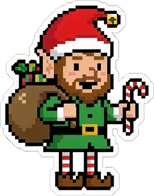</a>   |
| 23  |               [Ruta de regalos](https://adventjs.dev/es/challenges/2025/23)               |   MEDIO    |   <a href='https://github.com/cundodev/AdventJS/tree/main/2025/23'>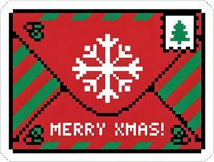</a>    |
| 24  | [Verifica si los árboles son espejos mágicos](https://adventjs.dev/es/challenges/2025/24) |   MEDIO    |        |
| 25  |         [Ejecuta el lenguaje mágico](https://adventjs.dev/es/challenges/2025/25)          |   MEDIO    |                 |
